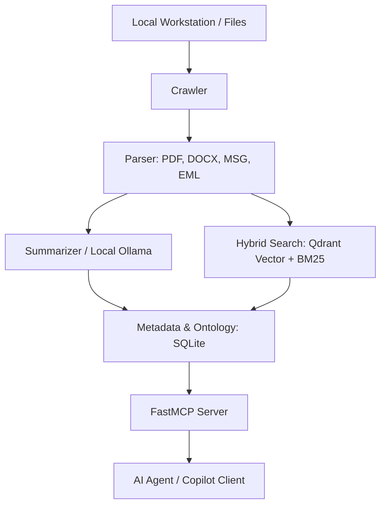

    
[](https://github.com/dgaida/academic-memory-mcp/tags)
[](https://www.python.org/downloads/)
[](https://codecov.io/gh/dgaida/academic-memory-mcp)
[](https://dgaida.github.io/academic-memory-mcp/)
[](https://github.com/dgaida/academic-memory-mcp/graphs/commit-activity)

[](https://github.com/astral-sh/ruff)

# MCP University Memory System

## What is this project really about?

The **MCP University Memory System** is an offline-first, agentic knowledge and memory environment specifically designed to handle the daily demands of university teaching, research, and student administration.

Professors and academic researchers are flooded with emails, thesis submissions, meeting requests, and document organization. Traditional tools manage these as separate silos, leaving academics to manually connect the dots between emails, course responsibilities, active student theses, and calendar appointments.

This repository solves this problem by creating a **unified local cognitive layer**. It operates completely locally to guarantee privacy and confidentiality for student information (PII). By combining intelligent local document parsing, vector database storage, semantic classification, and local Large Language Models (LLMs) via the **Model Context Protocol (FastMCP)**, it acts as an intelligent, context-aware co-pilot tailored to an academic workstation.

---

## Core Philosophy & Design

1. **Local and Private-First:** Academic correspondence and student records are subject to strict privacy rules. All document indexing, hybrid search, email classification, and LLM processing (via Ollama) occur strictly on your local machine.  
2. **Contextual Integration:** Rather than just storing files, the system understands how a document, an email from a student, a thesis project (Bachelor/Master), and a calendar event are connected. It maps these relations inside a local SQLite Metadata Store and Ontology Graph.  
3. **Agentic Automation:** Integrated directly with the Model Context Protocol (FastMCP), it exposes tools to AI agents. It does not just search—it drafts responses, schedules appointments, and creates student dossiers/summaries.  

---

## How It Works: The Ecosystem



### 1. Document & Folder Crawling (`mcp_university/crawler/` & `parser/`)
The crawler monitors academic directories, watching for new or updated files (lecture slides, papers, student theses). It parses PDFs, Word documents, and Outlook emails (EML/MSG format), extracting text and metadata (such as authors, dates, and affiliations).

### 2. Semantic Memory & Retrieval (`mcp_university/retrieval/` & `summarizer/`)
Parsed data is converted into local embeddings (e.g., MiniLM, BGE-M3) and indexed in Qdrant (for vector-based semantic search) and combined with BM25 (for keyword-based text search). Local LLMs (specifically `gemma4:e2b` via Ollama) process documents to automatically generate hierarchical summaries of entire research folders.

### 3. Knowledge Graph & Ontology Store (`mcp_university/metadata/`)
An offline SQLite database stores metadata, student progress, module responsibilities, and calendar slots. An active **Ontology Learner** extracts and refines relationships (such as matching student names to email aliases) and resolves variations automatically.

### 4. Specialised E-Mail Classifier (`packages/email_classifier/`)
Emails are categorized using advanced machine learning pipelines (Random Forest, XGBoost, or PyTorch-based transformers). They map messages directly to academic action categories like Thesis topics, Exam regulations, Colloquium bookings, or general student inquiries.

---

## Real-World Workflows & Scenarios

Here is how the system transforms standard daily academic routines:

### Scenario A: The Smart Email Reply Workflow
When a new email is processed:  
1. The machine-learning pipeline classifies the email (e.g., student inquiring about Bachelor thesis guidelines).  
2. The **Person Profiler** retrieves the student's background from the local database, checks active ontology records, and summarizes their past emails.  
3. The local LLM generates a personalized draft reply in the correct tone (`Du` vs `Sie`), matching the professor’s exact style, using the relevant files from the database (e.g., inserting the current thesis guidelines doc).  
4. The draft is presented to the user in a custom Gradio GUI for a single-click review, manual correction, and sending.  

### Scenario B: Meeting & Office Hours Preparation
Before a weekly block of meetings or student office hours:  
1. The system analyzes the upcoming Outlook calendar appointments.  
2. For each attendee, it crawls active folders, correspondence history, and research proposals to compile a **Steckbrief** (Markdown-based person profile) containing the student's details, past discussions, and active files.  
3. The academic can sit down with a single, auto-generated brief containing everything needed to run the meeting productively.  

### Scenario C: Unified Thesis Tracking & Colloquiums
When a student submits their final thesis:  
1. The system parses the document, extract-checks the metadata, and files the PDF correctly in the student's semester folder.  
2. It automatically prompts a calendar scheduling flow to book the colloquium exam in Outlook.  
3. It integrates with external tools (such as [colloquium-protocol-creator](https://dgaida.github.io/colloquium-protocol-creator/)) to pre-fill official forms and grading logs.  

---

## Prerequisites  
- **Python:** version 3.10 or higher.  
- **Ollama:** Set up and running locally with your desired models (e.g., `gemma4:e2b`).  
- **qmd CLI:** Global NPM utility for hybrid search: `npm install -g @tobilu/qmd`.  
- **Docling:** Install with `pip install docling` for robust PDF parsing.  

---

## Getting Started

### 1. Installation
Install the project in editable mode, which configures both the core CLI tools and individual subpackages:
```bash
pip install -e .
```

### 2. Configuration & Workspace Setup
Create your configuration files from the templates provided:
```bash
# Set up your environment variables and folder structures
cp config/user.yaml.example config/user.yaml
cp .env.example .env
```
Open `config/user.yaml` to map your local email archives, lecture slides, and student thesis directories.

### 3. Usage & Main CLI Commands

The system is controlled via the `mcp-uni` command-line utility and local scripts:

*   **Build the Search Index:**  
    Scan your folders and index documents into your local hybrid search:
    ```bash
    mcp-uni index
    ```

*   **Search Your Memory System:**  
    Query your personal, local vector and text knowledge base:
    ```bash
    mcp-uni search "Themenvorschlag Bachelorarbeit Machine Learning"
    ```

*   **Process, Classify, and Sort E-Mails:**  
    Sort incoming email files, trigger active reply drafting, and compile person profiles:
    ```bash
    python scripts/process_sorted_emails.py
    ```

*   **Start the Local Interactive Review GUI:**  
    Launch the Gradio review board to examine classified emails, preview draft answers, and check attachments:
    ```bash
    python scripts/email_search_gui.py
    ```

*   **Serve as a Model Context Protocol (MCP) Server:**  
    Expose your local knowledge base, file tools, database management, and summarization engines as tools to an MCP-compatible client (such as Claude Desktop):
    ```bash
    mcp-uni serve-mcp
    ```

---

## Technical Architecture & Packages

The repository is organized cleanly to separate backend processing, data modeling, and user interfaces:

-   `mcp_university/`: Core application containing crawler watching logic, Parsers, Metadata Store (SQLite DB), Retrieval systems, and FastMCP server definitions.  
-   `packages/email_classifier/`: Dedicated email classification engine utilizing traditional ML models and deep learning PyTorch Transformers.  
-   `outlook_macro/`: VBA macros for deep, native integration into Windows Outlook to export `.msg` files, appointments, and calendar schedules directly to the processing folders.  
-   `docs/`: Full, multilingual (English and German) end-user and technical documentation. To view, run `mkdocs serve`.  

For deep dives into ontology learning, database schemas, and tool-use mechanics, consult the [Full Documentation Pages](https://dgaida.github.io/academic-memory-mcp/).
