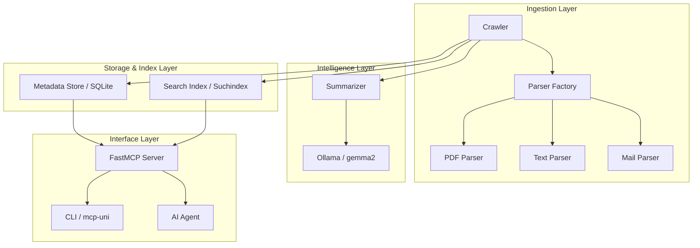
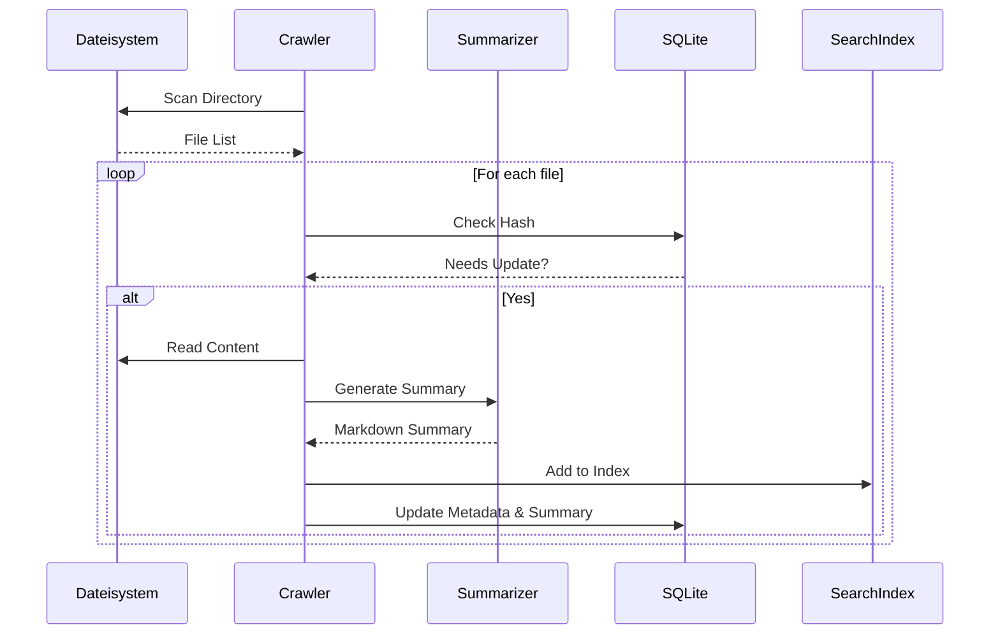

# Architektur

Das MCP University Memory System ist modular aufgebaut, um Flexibilität bei den Modellen und Robustheit bei der Datenverarbeitung zu gewährleisten.

## Systemübersicht

Das folgende Diagramm zeigt die Interaktion zwischen den Kernkomponenten:

## Datenfluss

1.  **Crawling:** Der Crawler scannt Verzeichnisse und vergleicht Dateihashes mit der SQLite-DB.  
2.  **Parsing:** Neue oder geänderte Dateien werden durch die Factory an den passenden Parser übergeben.  
3.  **Summarization:** Der extrahierte Text wird (gekürzt auf das Kontextfenster) an Ollama gesendet, um eine strukturierte Zusammenfassung zu erhalten.  
4.  **Indexierung:** Der Volltext wird im Suchindex-Index für die BM25- und Vektorsuche hinterlegt.  
5.  **Bereitstellung:** Über FastMCP werden Tools definiert, die auf die DB und den Index zugreifen, um Anfragen von Agenten zu beantworten.  

## Prozesslebenszyklus

