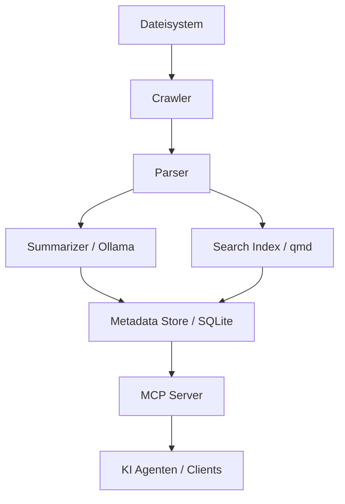

# MCP University Memory System


Das **MCP University Memory System** ist ein lokales, agentisches Wissens- und Gedächtnissystem, das speziell für die Anforderungen in Universitäten, Forschung und Studentenmanagement entwickelt wurde.

Es nutzt lokale Large Language Models (LLMs) und moderne Retrieval-Technologien, um eine datenschutzkonforme und leistungsstarke Wissensbasis aufzubauen.

## Hauptmerkmale

*   **Lokale Verarbeitung:** Alle Daten bleiben auf Ihrem System. Nutzung von Ollama für LLMs.
*   **Intelligentes Crawling:** Automatische Indexierung lokaler Ordner und Dokumente.
*   **Strukturierte Zusammenfassungen:** Erstellung von Datei- und Ordner-Summaries im universitären Kontext.
*   **Hybride Suche:** Kombination aus semantischer Suche (Vektoren) und klassischer Stichwortsuche (BM25).
*   **MCP-Integration:** Nahtlose Anbindung an KI-Agenten über das Model Context Protocol.
*   **Studenten-Kontext:** Spezialisierte Tools zur Verwaltung von Studentendaten, Abschlussarbeitsthemen und Kommunikation.

## Quickstart

Installieren Sie das System im editierbaren Modus:

```bash
pip install -e .
```

Indizieren Sie Ihre ersten Dokumente:

```bash
mcp-uni index
```

Starten Sie den MCP-Server:

```bash
mcp-uni serve-mcp
```

## Architektur auf einen Blick


