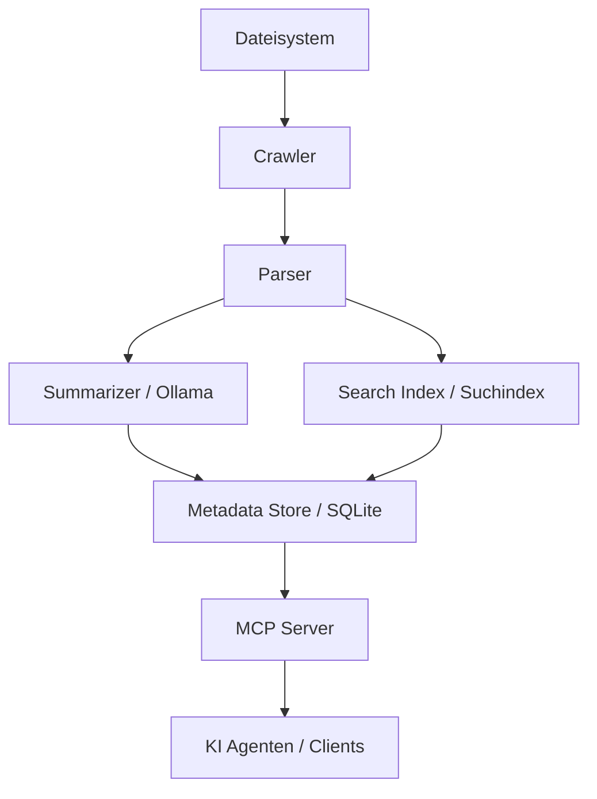

# MCP University Memory System

Das **MCP University Memory System** ist ein lokales, agentisches Wissens- und Gedächtnissystem, das speziell für die Anforderungen in Universitäten, Forschung und Studentenmanagement entwickelt wurde.

Es nutzt lokale Large Language Models (LLMs) und moderne Retrieval-Technologien, um eine datenschutzkonforme und leistungsstarke Wissensbasis aufzubauen.

-   :material-email-fast:{ .lg .middle } __Automatisiertes Verfassen von E-Mails__

    Nutzen Sie KI, um passgenaue Antwortentwürfe basierend auf dem Konversationsverlauf zu erstellen.

    [:octicons-arrow-right-24: E-Mail Workflow](usage/email-workflow.md)

-   :material-calendar-check:{ .lg .middle } __Terminvorbereitung__

    Bereiten Sie sich effizient auf Termine vor, indem Sie alle relevanten Informationen auf einen Blick sehen.

    [:octicons-arrow-right-24: Terminverwaltung](usage/appointment-management.md)

-   :material-magnify:{ .lg .middle } __E-Mail Suche__

    Durchsuchen Sie tausende archivierte E-Mails blitzschnell mit der dedizierten Such-GUI.

    [:octicons-arrow-right-24: E-Mail Suche](usage/email-search.md)

-   :material-account-details:{ .lg .middle } __Wissensbasis & Personen__

    Verwalten Sie Personen-Steckbriefe und nutzen Sie den Wissensgraphen für tiefe Einblicke.

    [:octicons-arrow-right-24: Personen-Profile](usage/profiles.md)

## Hauptmerkmale

*   **Lokale Verarbeitung:** Alle Daten bleiben auf Ihrem System. Nutzung von Ollama für LLMs.
*   **Intelligentes Crawling:** Automatische Indexierung lokaler Ordner und Dokumente.
*   **Strukturierte Zusammenfassungen:** Erstellung von Datei- und Ordner-Summaries im universitären Kontext.
*   **Hybride Suche:** Kombination aus semantischer Suche (Vektoren) und klassischer Stichwortsuche (BM25).
*   **MCP-Integration:** Nahtlose Anbindung an KI-Agenten über das Model Context Protocol.

## Architektur auf einen Blick

