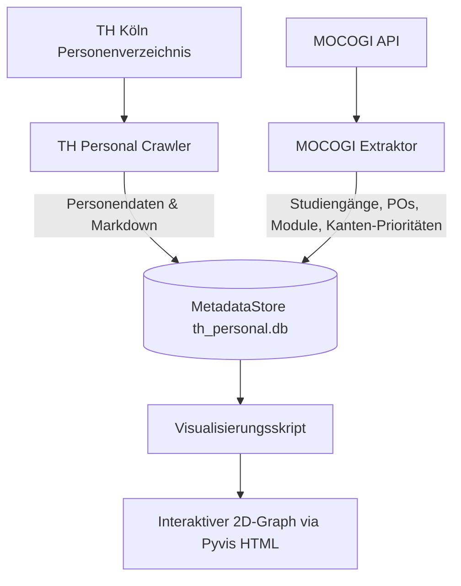

# TH Personal und Modulzuordnungen Graph (Package)

Dieses Package bietet eine integrierte Lösung zur automatisierten Extraktion, Speicherung und Visualisierung von Personen- und Modulinformationen der TH Köln. Es ermöglicht den Aufbau eines Personal- und Modulzuordnungsgraphen in `th_personal.db` und dessen interaktive Erkundung im Browser.

## Struktur des Packages

Das Package ist in funktionale Bereiche unterteilt:

### Benutzer-Skripte (`th_personal_graph.scripts`)
Diese Skripte sind für den direkten Aufruf durch den Benutzer über das Python-Modulsystem gedacht:  
- **TH Personal Crawler (`crawl_th_koeln_persons.py`):** Crawlt das offizielle TH-Köln-Personenverzeichnis, extrahiert Kontaktdaten, Fakultäten und akademische Grade und speichert sie in Markdown sowie in der lokalen SQLite-Datenbank `th_personal.db`.  
- **MOCOGI Extraktor (`extract_mocogi_data.py`):** Ruft Daten über Studiengänge, Prüfungsordnungen (PO) und Modulzuordnungen über die offizielle MOCOGI-API ab, liest Modulverantwortliche und Prüfer aus und verknüpft sie mit den Personen im Graphen in `th_personal.db`.  
- **Visualisierung (`visualize_knowledge_graph.py`):** Generiert ein interaktives 2D-Netzwerkdiagramm auf Basis von Pyvis (HTML) aus `th_personal.db`, welches im Webbrowser geöffnet werden kann.  

### Interne Module & Datenbanken
Das Package arbeitet eng mit den Kerndatenbanken von `mcp_university` zusammen:  
- **`MetadataStore`:** Lokale SQLite-Datenbank für Personen- und Moduldaten (`th_personal.db`).  

## Dokumentationsübersicht

- [**Nutzung der Skripte**](usage.md) - Beispiele und Anleitungen für die CLI-Skripte.  
- [**Architektur & Logik**](architecture.md) - Details über Datenmodell, API-Aufrufe, Kanten-Ersetzungslogik und Visualisierung.  
