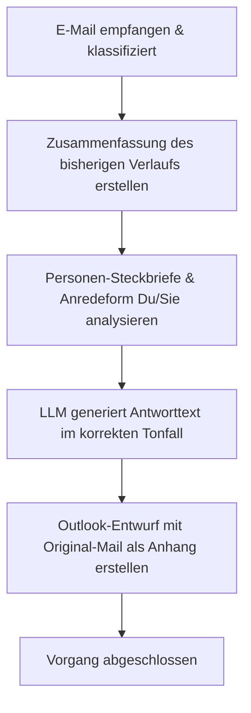

# Aktion 1: Antwort schreiben

Diese Aktion generiert einen standardmäßigen oder themenspezifischen E-Mail-Antwortentwurf auf Basis des Inhalts einer eingegangenen E-Mail.

## Funktionsweise und Details

Das System führt bei dieser Aktion folgende Schritte aus:

1.  **Konversationsanalyse:** Es wird eine prägnante Zusammenfassung des bisherigen E-Mail-Verlaufs im Ordner des Studenten erstellt bzw. aktualisiert (`.emails_summary.md`), um den Kontext für das Sprachmodell (LLM) bereitzustellen.  
2.  **Berücksichtigung von Profilen:** Das LLM bezieht sowohl Ihren eigenen Dozenten-Steckbrief (Ihre Rolle, Signatur, Tonalität) als auch den Steckbrief des Studenten mit ein.  
3.  **Anrede-Ermittlung (Du/Sie):** Die bevorzugte Anredeform (Du oder Sie) wird automatisch anhand des Verlaufs der letzten 8 E-Mails (4 gesendete, 4 empfangene) ermittelt.  
4.  **Generierung:** Das lokale LLM (standardmäßig `gemma4:e2b`) entwirft eine präzise, kontextbezogene und freundliche Antwort auf Deutsch.  
5.  **Entwurfserstellung:** Es wird automatisch ein E-Mail-Entwurf direkt in Microsoft Outlook erzeugt. Die Original-Mail wird dabei als Anhang beigefügt, damit der Verlauf gewahrt bleibt.  

---

## Prozessablauf (Mermaid Diagramm)

