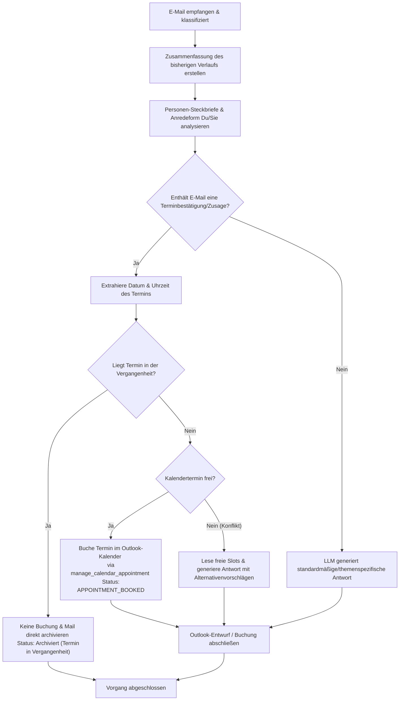

# Aktion 1: Antwort schreiben

Diese Aktion generiert einen standardmäßigen oder themenspezifischen E-Mail-Antwortentwurf auf Basis des Inhalts einer eingegangenen E-Mail.

## Funktionsweise und Details

Das System führt bei dieser Aktion folgende Schritte aus:

1.  **Konversationsanalyse:** Es wird eine prägnante Zusammenfassung des bisherigen E-Mail-Verlaufs im Ordner des Studenten erstellt bzw. aktualisiert (`.emails_summary.md`), um den Kontext für das Sprachmodell (LLM) bereitzustellen.  
2.  **Berücksichtigung von Profilen:** Das LLM bezieht sowohl Ihren eigenen Dozenten-Steckbrief (Ihre Rolle, Signatur, Tonalität) als auch den Steckbrief des Studenten mit ein.  
3.  **Anrede-Ermittlung (Du/Sie):** Die bevorzugte Anredeform (Du oder Sie) wird automatisch anhand des Verlaufs der letzten 8 E-Mails (4 gesendete, 4 empfangene) ermittelt.  
4.  **Generierung:** Das lokale LLM (standardmäßig `gemma4:e2b`) entwirft eine präzise, kontextbezogene und freundliche Antwort auf Deutsch.  
5.  **Entwurfserstellung:** Es wird automatisch ein E-Mail-Entwurf direkt in Microsoft Outlook erzeugt. Die Original-Mail wird dabei als Anhang beigefügt, damit der Verlauf gewahrt bleibt.  

---

## Intelligente Terminbuchung & Konfliktprüfung (Integrierte Logik)

Wenn das System eine E-Mail beantwortet, prüft es automatisch im Hintergrund auf Terminvorschläge oder Terminbestätigungen (Zusagen) seitens des Absenders. Dadurch wird die ehemals separate **Aktion 3: Termin direkt buchen** nun vollständig und nahtlos von Aktion 1 abgedeckt.

### Ablauf der integrierten Terminbuchung:

1. **Erkennung:** Das LLM analysiert die eingehende Mail auf konkrete Terminvorschläge (z. B. "Passt es am Dienstag um 14:00?") oder Zusagen (z. B. "Ich nehme den Termin am Montag um 15:30 Uhr").
2. **Datum- und Uhrzeitextraktion:** Die KI extrahiert das gewünschte und bestätigte Datum sowie die Uhrzeit aus der E-Mail.
3. **Prüfung auf Gültigkeit (Vergangenheit):** Es wird überprüft, ob der vorgeschlagene Termin in der Vergangenheit liegt.
    *   **Falls in der Vergangenheit:** Es wird kein Kalendereintrag erstellt. Die E-Mail wird direkt archiviert (Status: `Archiviert (Termin in Vergangenheit)`).
4. **Intelligenter Kalenderabgleich & Konfliktprüfung:**
    * Das System liest die bestehenden Termine aus der Datei `data/appointments.md`.
    * Es prüft, ob zu dem vorgeschlagenen oder bestätigten Zeitpunkt bereits ein Termin oder ein Blocker existiert:
        * **Frei (Zusage/Buchung):** Wenn kein Termin oder nur ein Blocker speziell für diesen Termin/Studenten eingetragen ist, bucht das System den Termin über das Tool `manage_calendar_appointment` direkt im Outlook-Kalender des Benutzers. Die Standarddauer beträgt **30 Minuten**, und die Zeitzone ist auf `Europe/Berlin` eingestellt. Das System antwortet mit dem Signalwort `APPOINTMENT_BOOKED` und die E-Mail wird im studentischen Archiv-Ordner abgelegt.
        * **Belegt (Konflikt):** Wenn ein anderer Termin oder ein generischer Blocker im Weg steht, erkennt das System dies als Konflikt.
5. **Alternativenvorschlag bei Konflikten:**
    * Falls ein Konflikt erkannt wird, liest das System automatisch die freien Terminslots aus `data/free_slots.md` (über das Tool `get_appointment_slots`) ein.
    * Es schlägt diese freien Termine als Alternativen in der Antwort-E-Mail vor und bittet den Absender um eine neue Auswahl.

---

## Prozessablauf (Mermaid Diagramm)

