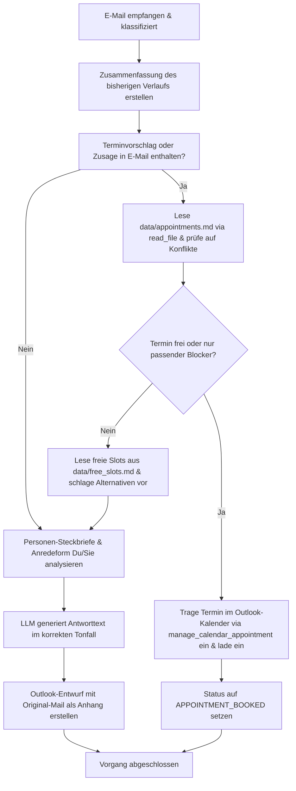

# Aktion 1: Antwort schreiben

Diese Aktion generiert einen standardmäßigen oder themenspezifischen E-Mail-Antwortentwurf auf Basis des Inhalts einer eingegangenen E-Mail. Sie integriert ab sofort auch die intelligente Termin- und Konfliktprüfung.

## Funktionsweise und Details

Das System führt bei dieser Aktion folgende Schritte aus:

1.  **Konversationsanalyse:** Es wird eine prägnante Zusammenfassung des bisherigen E-Mail-Verlaufs im Ordner des Studenten erstellt bzw. aktualisiert (`.emails_summary.md`), um den Kontext für das Sprachmodell (LLM) bereitzustellen.  
2.  **Berücksichtigung von Profilen:** Das LLM bezieht sowohl Ihren eigenen Dozenten-Steckbrief (Ihre Rolle, Signatur, Tonalität) als auch den Steckbrief des Studenten mit ein.  
3.  **Anrede-Ermittlung (Du/Sie):** Die bevorzugte Anredeform (Du oder Sie) wird automatisch anhand des Verlaufs der letzten 8 E-Mails (4 gesendete, 4 empfangene) ermittelt.  
4.  **Intelligente Termin- & Konfliktprüfung:** Das LLM prüft, ob in der Mail ein Terminvorschlag oder eine Zusage enthalten ist:
    - **Kalender-Abgleich:** Ist dies der Fall, liest das System über das Tool `read_file` die Datei `data/appointments.md` ein, um zu prüfen, ob zu der Zeit bereits ein Termin oder ein Blocker existiert.
    - **Intelligente Unterscheidung:** Ein Blocker speziell für diese Besprechung oder diesen Studenten gilt als frei. Ein ganz anderer Termin oder ein generischer Blocker steht der Anfrage im Weg.
    - **Aktion bei Verfügbarkeit (ehemals Aktion 3):** Wenn der Termin frei ist, wird er über `manage_calendar_appointment` direkt im Outlook-Kalender gebucht, der Student eingeladen, und der Status auf `APPOINTMENT_BOOKED` gesetzt.
    - **Aktion bei Konflikt:** Ist der Termin belegt, liest das System freie Slots aus `data/free_slots.md` (über das Tool `get_appointment_slots`) ein und schlägt diese als Alternativen in der Antwort-Mail vor.
5.  **Generierung:** Das lokale LLM (standardmäßig `gemma4:e2b`) entwirft eine präzise, kontextbezogene und freundliche Antwort auf Deutsch.
6.  **Entwurfserstellung:** Es wird automatisch ein E-Mail-Entwurf direkt in Microsoft Outlook erzeugt. Die Original-Mail wird dabei als Anhang beigefügt, damit der Verlauf gewahrt bleibt.

---

## Prozessablauf (Mermaid Diagramm)

