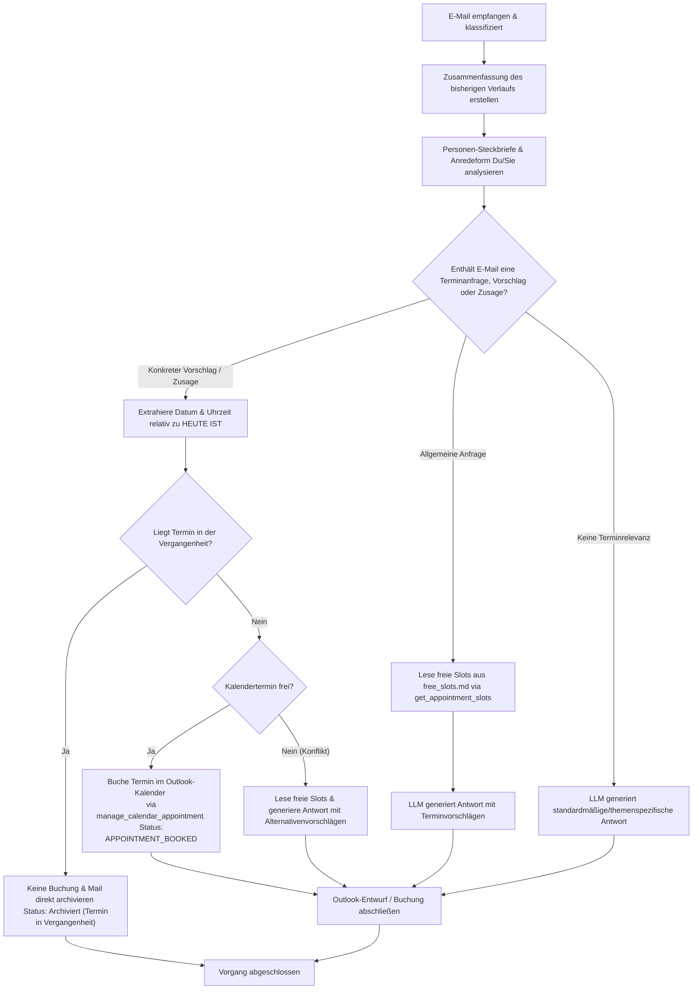

# Aktion 1: Antwort schreiben

Diese Aktion generiert einen standardmäßigen oder themenspezifischen E-Mail-Antwortentwurf auf Basis des Inhalts einer eingegangenen E-Mail. Sie deckt auch allgemeine Terminanfragen, konkrete Terminvorschläge sowie Terminbestätigungen vollständig ab.

## Funktionsweise und Details

Das System führt bei dieser Aktion folgende Schritte aus:

1. **Konversationsanalyse:** Es wird eine prägnante Zusammenfassung des bisherigen E-Mail-Verlaufs im Ordner des Studenten erstellt bzw. aktualisiert (`.emails_summary.md`), um den Kontext für das Sprachmodell (LLM) bereitzustellen.
2. **Berücksichtigung von Profilen:** Das LLM bezieht sowohl Ihren eigenen Dozenten-Steckbrief (Ihre Rolle, Signatur, Tonalität) als auch den Steckbrief des Studenten mit ein.
3. **Anrede-Ermittlung (Du/Sie):** Die bevorzugte Anredeform (Du oder Sie) wird automatisch anhand des Verlaufs der letzten 8 E-Mails (4 gesendete, 4 empfangene) ermittelt.
4. **Generierung:** Das lokale LLM entwirft eine präzise, kontextbezogene und freundliche Antwort auf Deutsch.
5. **Entwurfserstellung:** Es wird automatisch ein E-Mail-Entwurf direkt in Microsoft Outlook erzeugt. Die Original-Mail wird dabei als Anhang beigefügt, damit der Verlauf gewahrt bleibt.

### E-Mail-Signatur-Integration

Das System unterstützt das automatische Laden und Integrieren Ihrer in Outlook hinterlegten Standard-E-Mail-Signatur. Beim Erzeugen des Entwurfs greift das System über die Outlook-Schnittstelle (`win32com`) auf das Postfach zu und führt die folgenden Schritte aus:

1. **Signatur-Erkennung:** Ein leerer E-Mail-Entwurf wird initialisiert, um das Laden der Standard-Signatur durch Outlook zu erzwingen.  
2. **Inhalts-Injektion:**  
    - Falls eine reich formatierte HTML-Signatur hinterlegt ist, wird der vom LLM generierte Antworttext automatisch in HTML konvertiert (Sonderzeichen maskiert, Zeilenumbrüche in HTML-Zeilenumbrüche ` ` umgewandelt) und präzise am Anfang des `<body>`-Abschnitts der Signatur injiziert. Dadurch bleibt das Layout und das Design Ihrer offiziellen Signatur vollständig erhalten.
    - Falls nur eine Text-Signatur vorhanden ist, wird der Antworttext sauber vor dieser platziert.
3. **Robuster Fallback:** Sollte keine Signatur geladen werden können oder das Feature deaktiviert sein, wird der Antwortentwurf wie gewohnt als reiner Text erstellt.  

---

## Intelligente Terminverarbeitung & Konfliktprüfung

Wenn das System eine E-Mail beantwortet, prüft es automatisch im Hintergrund auf allgemeine Terminanfragen, konkrete Terminvorschläge oder Terminbestätigungen (Zusagen) seitens des Absenders.

### Ermittlung des konkreten Datums bei relativen Datumsangaben

Relative Aussagen wie *"Passt es am Dienstag um 14:00?"* oder *"Ich nehme den Termin am Montag um 15:30 Uhr"* enthalten kein absolutes Datum (z. B. `2026-07-21`). Das System ermittelt das konkrete Datum wie folgt:

1. **Aktueller Referenzzeitpunkt:** Dem LLM wird im Prompt stets der exakte aktuelle Zeitpunkt mit Wochentag, Datum, Uhrzeit und Zeitzone übergeben:
   `HEUTE IST: <Wochentag>, den <DD.MM.YYYY HH:MM>` (z. B. `Freitag, den 17.07.2026 14:00` in der Zeitzone `Europe/Berlin`).
2. **Chain-of-Thought (CoT) Abgleich:** Das Sprachmodell nutzt den im `SKILL_Appointment.md` definierten Schritt-für-Schritt-Denkprozess:
    - Es bestimmt ausgehend vom Referenzdatum den nächsten passenden Wochentag (z. B. von Freitag, 17.07.2026 ausgehend ist Dienstag der 21.07.2026).
    - Sendedaten aus vorherigen E-Mail-Headern (z. B. `On Thu, 16 Jul 2026...`) werden dabei explizit ignoriert, um Verfälschungen durch alte Nachrichten zu verhindern.

### Ablauf der integrierten Terminverarbeitung:

1. **Erkennung:** Das LLM analysiert die eingehende Mail:
    - **Allgemeine Terminanfrage / Wunsch:** Enthält die Mail nur einen allgemeinen Wunsch nach einem Termin ohne konkretes Datum, ruft das System `get_appointment_slots` auf, um die verfügbaren freien Slots aus `data/free_slots.md` zu laden und direkt als Vorschläge in den Antwortentwurf einzufügen.
    - **Konkreter Vorschlag / Zusage:** Enthält die Mail ein konkretes Datum und eine Uhrzeit, führt das LLM die Datumsermittlung durch.
2. **Prüfung auf Gültigkeit (Vergangenheit):** Es wird überprüft, ob der ermittelte Termin in der Vergangenheit liegt.
    - **Falls in der Vergangenheit:** Es wird kein Kalendereintrag erstellt. Die E-Mail wird direkt archiviert (Status: `Archiviert (Termin in Vergangenheit)`).
3. **Intelligenter Kalenderabgleich & Konfliktprüfung:**
    - Das System liest die bestehenden Termine aus der Datei `data/appointments.md`.
    - Es prüft, ob zu dem vorgeschlagenen oder bestätigten Zeitpunkt bereits ein Termin oder ein Blocker existiert:
        - **Frei (Zusage/Buchung):** Wenn kein Termin oder nur ein Blocker speziell für diesen Termin/Studenten eingetragen ist, bucht das System den Termin über das Tool `manage_calendar_appointment` direkt im Outlook-Kalender des Benutzers. Die Standarddauer beträgt **30 Minuten**, und die Zeitzone ist auf `Europe/Berlin` eingestellt. Das System antwortet mit dem Signalwort `APPOINTMENT_BOOKED` und die E-Mail wird im studentischen Archiv-Ordner abgelegt.
        - **Belegt (Konflikt):** Wenn ein anderer Termin oder ein generischer Blocker im Weg steht, erkennt das System dies als Konflikt.
4. **Alternativenvorschlag bei Konflikten:**
    - Falls ein Konflikt erkannt wird, liest das System automatisch die freien Terminslots aus `data/free_slots.md` (über das Tool `get_appointment_slots`) ein.
    - Es schlägt diese freien Termine als Alternativen in der Antwort-E-Mail vor und bittet den Absender um eine neue Auswahl.

---

## Prozessablauf (Mermaid Diagramm)

```mermaid
graph TD
    A[E-Mail empfangen & klassifiziert] --> B[Zusammenfassung des bisherigen Verlaufs erstellen]
    B --> C[Personen-Steckbriefe & Anredeform Du/Sie analysieren]
    C --> D{Enthält E-Mail eine Terminanfrage, Vorschlag oder Zusage?}

    D -- Allgemeine Anfrage --> E1[Lese freie Slots aus free_slots.md via get_appointment_slots]
    E1 --> K[LLM generiert Antwort mit Terminvorschlägen]

    D -- Konkreter Vorschlag / Zusage --> E2[Extrahiere Datum & Uhrzeit relativ zu HEUTE IST]
    E2 --> F{Liegt Termin in der Vergangenheit?}
    F -- Ja --> G["Keine Buchung & Mail direkt archivieren <br> Status: Archiviert (Termin in Vergangenheit)"]
    F -- Nein --> H{Kalendertermin frei?}
    H -- Ja --> I["Buche Termin im Outlook-Kalender <br> via manage_calendar_appointment <br> Status: APPOINTMENT_BOOKED"]
    H -- Nein (Konflikt) --> J[Lese freie Slots & generiere Antwort mit Alternativenvorschlägen]

    D -- Keine Terminrelevanz --> L[LLM generiert standardmäßige/themenspezifische Antwort]

    I --> M[Outlook-Entwurf / Buchung abschließen]
    J --> M
    K --> M
    L --> M
    G --> N[Vorgang abgeschlossen]
    M --> N
```
