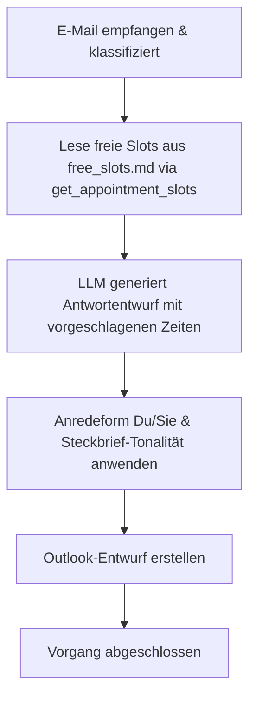

# Aktion 2: Antwort mit Terminvorschlag

Diese Aktion wird verwendet, wenn auf eine Anfrage geantwortet werden soll und gleichzeitig konkrete Terminvorschläge (z. B. für Sprechstunden oder Besprechungen) aus dem Kalender unterbreitet werden sollen.

## Funktionsweise und Details

Das System führt bei dieser Aktion folgende Schritte aus:

1.  **Konversationsanalyse:** Es wird eine prägnante Zusammenfassung des bisherigen E-Mail-Verlaufs im Ordner des Studenten erstellt bzw. aktualisiert (`.emails_summary.md`), um den Kontext für das Sprachmodell (LLM) bereitgestellt zu bekommen.
2.  **Auslesen der freien Zeiten:** Das System nutzt das Tool `get_appointment_slots`, welches die Datei `free_slots.md` einliest. Diese Datei wurde zuvor über Outlook-VBA-Makros mit Ihren aktuellen freien Zeiten gefüllt.
3.  **Formatierung und Filterung:** Die freien Zeitfenster werden ausgelesen und übersichtlich formatiert.
4.  **KI-Generierung:** Das lokale LLM entwirft das Antwortschreiben, bindet die gefundenen freien Slots ansprechend in die E-Mail ein und bittet den Empfänger um Bestätigung eines der Termine.
5.  **Anrede und Tonfall:** Auch hier werden die Steckbriefe und die ermittelte Anredeform (Du/Sie) berücksichtigt.
6.  **Entwurfserstellung:** Es wird ein Antwortentwurf in Outlook mit den integrierten Terminvorschlägen und der Original-Mail im Anhang angelegt.

---

## Prozessablauf (Mermaid Diagramm)

