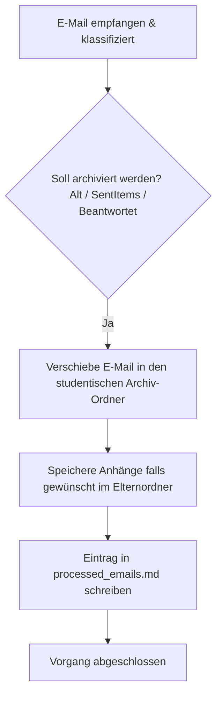

# Aktion 3: Nur archivieren

Diese Aktion wird verwendet, wenn auf eine E-Mail keine Antwort erforderlich ist und diese lediglich im studentischen Archiv-Ordner abgelegt werden soll.

## Funktionsweise und Details

Das System führt bei dieser Aktion folgende Schritte aus:

1.  **Automatische Vorschläge:** Das System schlägt diese Aktion in der Gradio GUI in folgenden Fällen automatisch vor:  
    *   **Alte E-Mails:** E-Mails, die älter als der konfigurierte Schwellenwert (z. B. 6 Monate) sind.  
    *   **Gesendete Objekte (`SentItems`):** E-Mails, die sich im Ordner `SentItems` befinden, benötigen niemals eine Antwort.  
    *   **Bereits beantwortet:** E-Mails, bei denen das System erkennt, dass kein Handlungsbedarf mehr besteht.  
2.  **Archivierung:** Die E-Mail wird physisch in das entsprechende studentische Archiv (`Semester / Nachname / Inbox` bzw. `SentItems`) verschoben.  
3.  **Anhänge (Optional):** Falls der Benutzer die Option "Anhang speichern" ausgewählt hat, werden die Anhänge der E-Mail automatisch direkt im übergeordneten studentischen Hauptordner abgelegt.  
4.  **Protokollierung:** Der Status wird in der Abschlussdatei `processed_emails.md` vermerkt.  

---

## Prozessablauf (Mermaid Diagramm)

