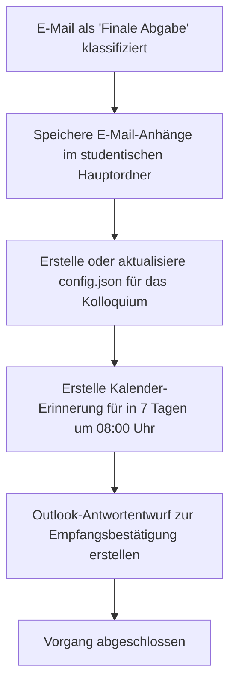

# Aktion 5: Aufgabe im Kalender anlegen (Finale Abgabe)

Diese Aktion ist die zentrale Steuerung für die finale Abgabe von Abschlussarbeiten (Bachelor- und Masterthesen). Wenn das System eine finale Abgabe detektiert, koordiniert diese Aktion eine Reihe von automatisierten Schritten zur Begleitung des Bewertungsprozesses.

## Funktionsweise und Details

Sobald diese Aktion ausgeführt wird, führt das System vollautomatisch folgende Schritte durch:

1.  **Speichern von Anhängen:** Alle Anhänge der E-Mail (wie die finale PDF-Arbeit) werden automatisch via `save_email_attachments` direkt im studentischen Hauptordner (`Semester / Nachname /`) abgelegt.
2.  **Kolloquium-Konfiguration (`config.json`):** Es wird automatisch eine `config.json` Datei im Hauptordner des Studenten mittels `create_colloquium_config` angelegt oder aktualisiert. Diese Datei enthält den genauen Dateinamen des PDF-Dokuments aus dem Anhang und dient als Konfigurationsschnittstelle für den [colloquium-protocol-creator](https://dgaida.github.io/colloquium-protocol-creator/).
3.  **Kalender-Erinnerung in 7 Tagen:** Über das Tool `manage_calendar_appointment` wird ein Kalendereintrag (Erinnerungstermin) in Ihrem Outlook-Kalender für **exakt 7 Tage nach E-Mail-Eingang um 08:00 Uhr** angelegt. Dies erinnert Sie rechtzeitig an das Lesen und Bewerten der eingegangenen Abschlussarbeit.
4.  **Bestätigungs-Antwortentwurf:** Es wird automatisch ein E-Mail-Entwurf in Outlook erzeugt, um dem Studierenden den offiziellen Empfang der Arbeit zu bestätigen.

---

## Prozessablauf (Mermaid Diagramm)

