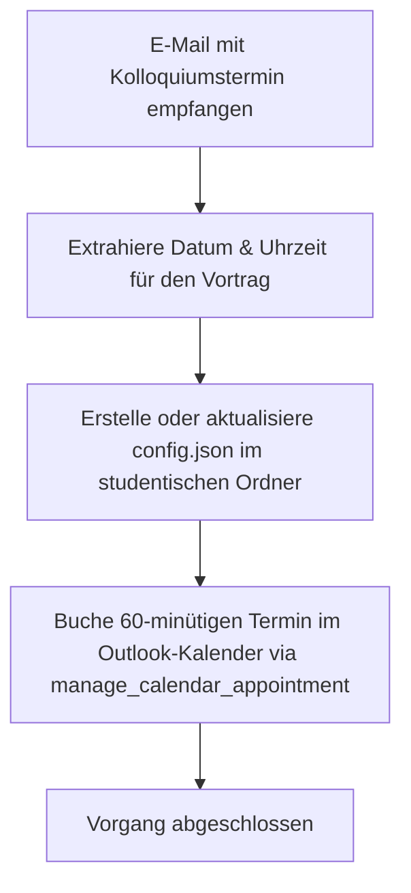

# Aktion 5: Kolloquium-Termin

Diese Aktion automatisiert den gesamten Prozess der Terminplanung und Daten-Vorbereitung für das Kolloquium (die mündliche Verteidigung einer Abschlussarbeit).

## Funktionsweise und Details

Sobald ein Termin für das Kolloquium per E-Mail vereinbart und bestätigt wird, stößt diese Aktion folgende Prozesse an:

1.  **Datum- und Uhrzeitextraktion:** Das System extrahiert das Datum (im Format `DD.MM.YYYY`) und die Uhrzeit (im Format `HH:MM`) des Kolloquiums aus der E-Mail.  
2.  **Erstellung/Aktualisierung der `config.json`:**  
    Das System legt im Hauptordner des Studenten automatisch eine Konfigurationsdatei namens `config.json` an (bzw. aktualisiert eine bestehende). In diese Datei werden die extrahierten Termindaten (Datum, Uhrzeit, Ort, Raum) eingetragen. Sie dient nachgelagert zur automatisierten Bewertung von Präsentationsfolien oder zum Ausfüllen von Formularen.  
3.  **Kalendereintrag erstellen:**  
    Das System trägt einen speziellen **60-minütigen** Termin direkt in Ihren Outlook-Kalender über das Tool `manage_calendar_appointment` ein, damit der Zeitraum für die Prüfung geblockt ist.

---

## Beispiel der erzeugten `config.json`

```json
{
  "task": "colloquium",
  "description": "Kolloquium auf dem Campus Gummersbach mit automatischer Gemini-Bewertung",
  "pdf": {
    "filename": "Bachelorarbeit.pdf"
  },
  "colloquium": {
    "date": "15.11.2026",
    "time": "14:00",
    "location_type": "campus",
    "room": "3.228"
  },
  "llm": {
    "api_choice": null,
    "model": null,
    "groq_free": true
  },
  "gemini_evaluation": {
    "enabled": false,
    "model": "gemini-2.0-flash-exp"
  },
  "output": {
    "folder": null,
    "compile_pdf": true,
    "fill_form_only": true
  }
}
```

---

## Prozessablauf (Mermaid Diagramm)


