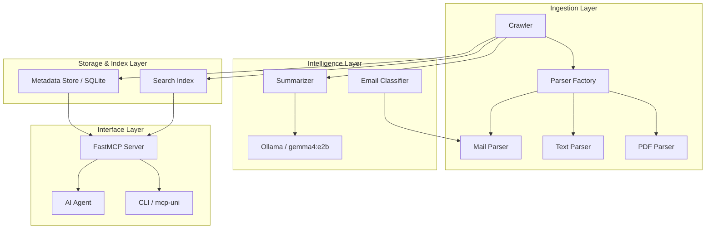
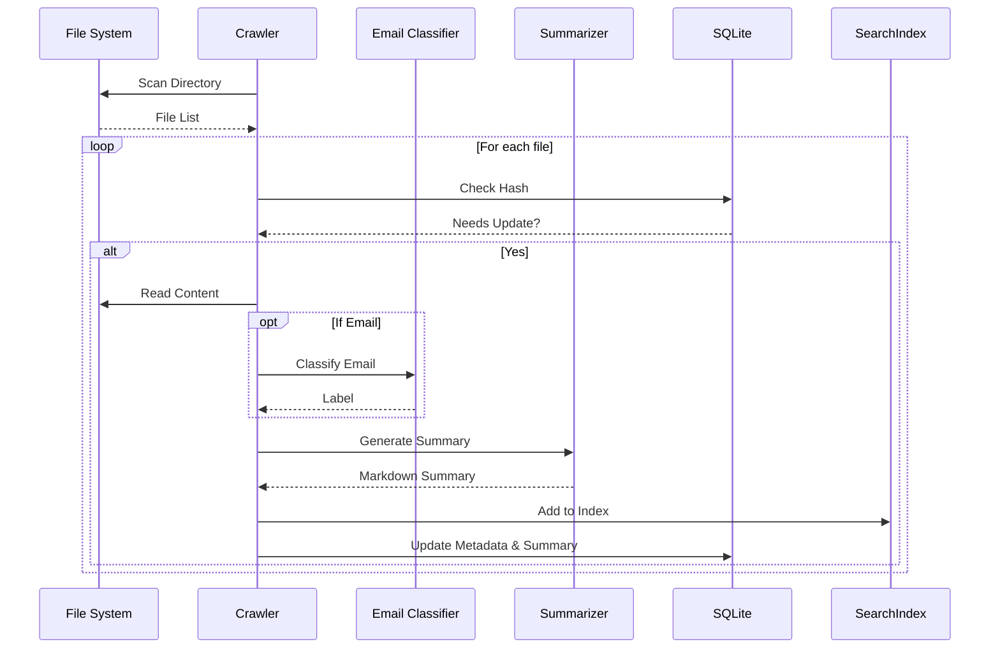

# Architecture

The MCP University Memory System is modularly designed to ensure flexibility in models and robustness in data processing.

## System Overview

The following diagram shows the interaction between the core components:

## Data Flow

1.  **Crawling:** The crawler scans directories and compares file hashes with the SQLite DB.  
2.  **Parsing:** New or modified files are passed through the factory to the appropriate parser.  
3.  **Classification:** The `EmailClassifier` can optionally be used to categorize emails before or after indexing.  
4.  **Summarization:** The extracted text is sent (truncated to the context window) to Ollama to obtain a structured summary.  
5.  **Indexing:** The full text is stored in the Search Index for BM25 and vector search.  
6.  **Delivery:** Tools are defined via FastMCP that access the DB and index to answer queries from agents.  

## Process Lifecycle

