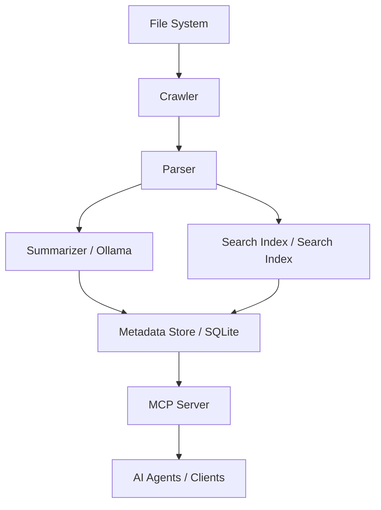

# MCP University Memory System


The **MCP University Memory System** is a local, agentic knowledge and memory system specifically designed for the requirements of universities, research, and student management.

It leverages local Large Language Models (LLMs) and modern retrieval technologies to build a privacy-compliant and powerful knowledge base.

## Key Features

*   **Local Processing:** All data stays on your system. Uses Ollama for LLMs.
*   **Intelligent Crawling:** Automatic indexing of local folders and documents.
*   **Structured Summaries:** Generation of file and folder summaries within a university context.
*   **Hybrid Search:** Combination of semantic search (vectors) and classic keyword search (BM25).
*   **MCP Integration:** Seamless connection to AI agents via the Model Context Protocol.
*   **Student Context:** Specialized tools for managing student data, thesis topics, and communication.

## Quickstart

Install the system in editable mode:

```bash
pip install -e .
```

Index your first documents:

```bash
mcp-uni index
```

Start the MCP server:

```bash
mcp-uni serve-mcp
```

## Architecture at a Glance


