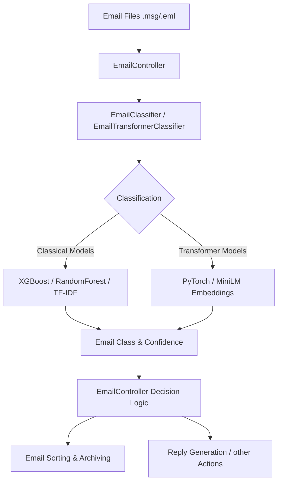

# Email Classifier (Package)

This package provides a comprehensive solution for the automated classification and sorting of student emails. It supports various machine learning models and provides tools for analysis and visualization.

## Package Structure

The package is divided into functional areas:

### User Scripts (`email_classifier.scripts`)
These scripts are intended for direct invocation by the user:  
- **Training & Evaluation:** `train.py`, `evaluate.py`  
- **Prediction & Sorting:** `predict.py`, `sort_emails.py`, `classify_folder.py`, `sort_by_direction.py`  
- **Analysis & Visualization:** `xai_analysis.py`, `plot_data_distribution.py`, `top_words.py`  

### Internal Modules & Core Modules
These modules form the core of the system and are mostly used internally:  

#### `engine.py`
Contains the base classes for classification:  
- **`EmailClassifier`**: Manages model loading, preprocessing, and predictions for classical models (RandomForest, XGBoost).  
- **`EmailTransformerClassifier`**: A PyTorch-based implementation for Transformer models.  
- **Vectorization**: Supports TF-IDF, embeddings (BGE-M3), and a combination of both.  

#### `controller.py`
The `EmailController` orchestrates the process:  
1. Loading configuration and model.  
2. Parsing incoming emails.  
3. Invoking classification.  
4. Deciding on further actions (sorting, reply generation).  

#### `stopwords.py`
Definition of stop words for text processing.

## Documentation Overview

- [**Script Usage**](usage.md) - Examples and guides for CLI tools.  
- [**Training & Evaluation**](training.md) - Details on training new models.  
- [**XAI & Visualization**](analysis.md) - Explainability and data analysis.  
- [**Neural Network Architecture**](nn_architecture.md) - Details on Transformer-based classification.  
