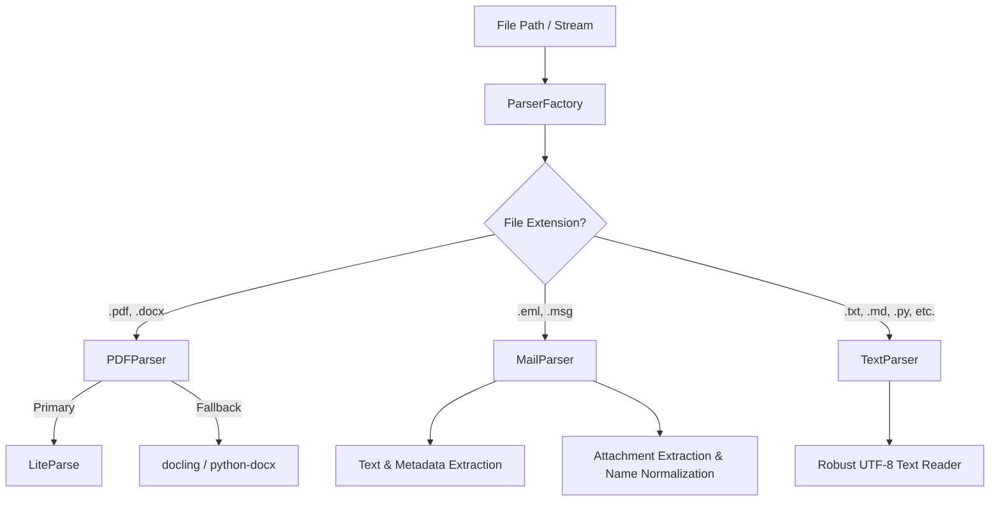

# Parser Sub-Package

The `academic_parser` sub-package provides a unified and powerful interface for extracting text and metadata from various file formats. It abstracts the complexity of different specialized Python libraries under a common, simple API.



## Overview of Parsers

The package includes three main specialized parsers, made available through a common factory (`ParserFactory`):

### 1. PDF & DOCX Parser (`PDFParser`)
The PDF parser is designed to extract formatted text from PDF and DOCX documents (such as lecture slides, worksheets, or module handbooks).  
- **Primary approach:** Uses `LiteParse` for rapid and structured extraction.  
- **Fallbacks:** Employs `docling` and `python-docx` in case of missing dependencies or complex layouts.  
- **Offline Mode:** Detects and supports offline operations automatically.  

### 2. Mail Parser (`MailParser`)
The mail parser handles `.eml` and `.msg` files (exported from Outlook or Thunderbird).  
- Extracts sender, recipients (To, Cc), date, and subject.  
- Processes multipart messages and reliably decodes text contents using various encodings (including Latin-1 fallback).  
- Supports extracting and saving email attachments.  
- Includes complex logic for extracting and normalizing surnames for email sorting.  

### 3. Text Parser (`TextParser`)
A lightweight parser for standard plain text files.  
- Supports `.txt`, `.md`, `.py`, `.json`, `.html`, `.ipynb`.  
- Reads contents with UTF-8 encoding and offers robust error handling.  

---

## The Parser Factory (`ParserFactory`)

The `ParserFactory` is the central hub for the entire system. It automatically determines which parser to load and run based on the file extension.

### Example Usage

```python
from pathlib import Path
from academic_parser.factory import ParserFactory

# Initialization with a cache directory for PDF artifacts
factory = ParserFactory(cache_dir=Path("./cache"))

# Parsing any supported file type
text = factory.parse(Path("curriculum.pdf"))
print(text)
```

## Additional Topics  
- [**Detailed Email Parsing & Name Extraction**](email-parsing.md)  
