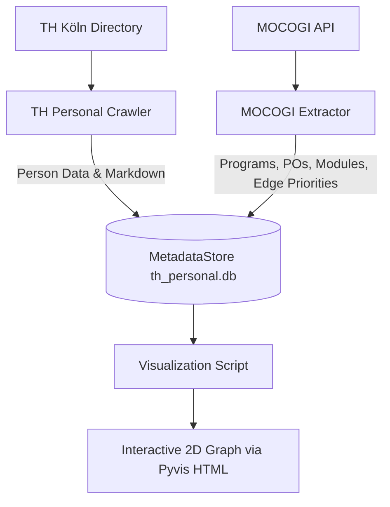

# TH Personal and Module Graph (Package)

This package provides an integrated solution for the automated extraction, storage, and visualization of personal and module information from TH Köln. It enables building a personnel and module assignment graph in `th_personal.db` and exploring it interactively in any browser.

## Package Structure

The package is divided into functional areas:

### User Scripts (`th_personal_graph.scripts`)
These scripts are intended for direct invocation by the user via Python's module system:  
- **TH Personal Crawler (`crawl_th_koeln_persons.py`):** Crawls the official TH Köln personnel directory, extracts contact details, faculties, and academic degrees, and saves them in Markdown as well as in the local SQLite database `th_personal.db`.  
- **MOCOGI Extractor (`extract_mocogi_data.py`):** Fetches study programs, examination regulations (PO), and module assignments via the official MOCOGI API, parses module coordinators and examiners, and links them with persons in the graph in `th_personal.db`.  
- **Visualization (`visualize_knowledge_graph.py`):** Generates an interactive 2D network diagram based on Pyvis (HTML) from `th_personal.db`, which can be opened in any web browser.  

### Internal Modules & Databases
The package works closely with the core databases of `mcp_university`:  
- **`MetadataStore`:** Local SQLite database for person and module data (`th_personal.db`).  

## Documentation Overview

- [**Script Usage**](usage.md) - Examples and guides for the CLI scripts.  
- [**Architecture & Logic**](architecture.md) - Details on data models, API calls, edge replacement logic, and visualization.  
