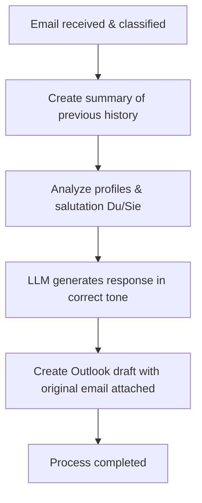

# Action 1: Write Reply

This action generates a standard or topic-specific email reply draft based on the content of an incoming email.

## How it Works and Details

The system performs the following steps during this action:

1.  **Conversation Analysis:** A concise summary of the previous email history is created or updated in the student's folder (`.emails_summary.md`) to provide context for the Language Model (LLM).  
2.  **Profile Integration:** The LLM takes into account both your own lecturer profile (your role, signature, and tone) and the student's profile.  
3.  **Salutation Determination (Du/Sie):** The preferred form of address (Du/informal or Sie/formal) is automatically determined based on the history of the last 8 emails (4 sent, 4 received).  
4.  **Generation:** The local LLM (by default `gemma4:e2b`) drafts a precise, context-aware, and polite response in German.  
5.  **Draft Creation:** An email draft is automatically created directly in Microsoft Outlook. The original email is attached to preserve the conversation history.  

---

## Process Flow (Mermaid Diagram)

