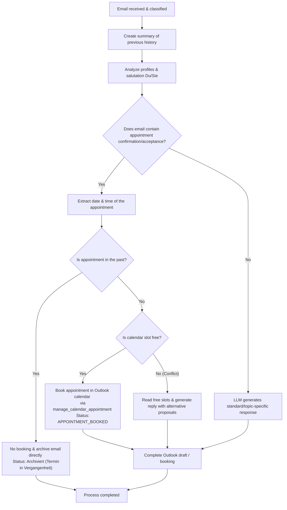

# Action 1: Write Reply

This action generates a standard or topic-specific email reply draft based on the content of an incoming email.

## How it Works and Details

The system performs the following steps during this action:

1.  **Conversation Analysis:** A concise summary of the previous email history is created or updated in the student's folder (`.emails_summary.md`) to provide context for the Language Model (LLM).  
2.  **Profile Integration:** The LLM takes into account both your own lecturer profile (your role, signature, and tone) and the student's profile.  
3.  **Salutation Determination (Du/Sie):** The preferred form of address (Du/informal or Sie/formal) is automatically determined based on the history of the last 8 emails (4 sent, 4 received).  
4.  **Generation:** The local LLM (by default `gemma4:e2b`) drafts a precise, context-aware, and polite response in German.  
5.  **Draft Creation:** An email draft is automatically created directly in Microsoft Outlook. The original email is attached to preserve the conversation history.  

---

## Intelligent Appointment Booking & Conflict Checking (Integrated Logic)

When the system responds to an email, it automatically checks the background for meeting proposals or meeting confirmations (acceptances) from the sender. As a result, the formerly separate **Action 3: Book Appointment** is now fully and seamlessly handled by Action 1.

### Workflow of Integrated Appointment Booking:

1. **Detection:** The LLM analyzes the incoming email for concrete meeting proposals (e.g., "Can we meet on Tuesday at 14:00?") or confirmations (e.g., "I accept the appointment on Monday at 15:30").
2. **Date and Time Extraction:** The AI extracts the requested and confirmed date and time from the email.
3. **Validity Check (Past):** It checks if the proposed appointment lies in the past.
    *   **If in the past:** No calendar entry is created. The email is archived directly (Status: `Archiviert (Termin in Vergangenheit)`).
4. **Intelligent Calendar Matching & Conflict Checking:**
    * The system reads existing appointments from the file `data/appointments.md`.
    * It checks whether an appointment or blocker already exists at the proposed or confirmed time:
        * **Free (Acceptance/Booking):** If there is no appointment or only a blocker specifically designated for this appointment/student, the system books the appointment in the user's Outlook calendar via the `manage_calendar_appointment` tool. The default duration is **30 minutes**, and the timezone is set to `Europe/Berlin`. The system responds with the signal word `APPOINTMENT_BOOKED` and the email is filed in the corresponding student archive folder.
        * **Busy (Conflict):** If a completely different appointment or a generic blocker is in the way, the system detects this as a conflict.
5. **Alternative Suggestions on Conflict:**
    * If a conflict is detected, the system automatically reads free appointment slots from `data/free_slots.md` (via the `get_appointment_slots` tool).
    * It suggests these free times as alternatives in the reply email and asks the sender to make a new selection.

---

## Process Flow (Mermaid Diagram)

