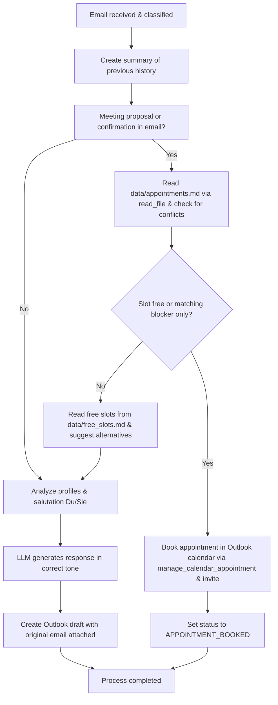

# Action 1: Write Reply

This action generates a standard or topic-specific email reply draft based on the content of an incoming email. It now seamlessly integrates the intelligent appointment and conflict-checking logic as well.

## How it Works and Details

The system performs the following steps during this action:

1.  **Conversation Analysis:** A concise summary of the previous email history is created or updated in the student's folder (`.emails_summary.md`) to provide context for the Language Model (LLM).  
2.  **Profile Integration:** The LLM takes into account both your own lecturer profile (your role, signature, and tone) and the student's profile.  
3.  **Salutation Determination (Du/Sie):** The preferred form of address (Du/informal or Sie/formal) is automatically determined based on the history of the last 8 emails (4 sent, 4 received).  
4.  **Intelligent Appointment & Conflict Check:** The LLM checks if the email contains a meeting proposal or a confirmation (acceptance):
    - **Calendar Alignment:** If so, the system reads existing appointments from `data/appointments.md` using the `read_file` tool to check for conflicts at the requested date and time.
    - **Intelligent Distinction:** A blocker designated specifically for this meeting or student is considered free. Any other meeting or a generic blocker stands in the way of the requested time.
    - **Action on Availability (formerly Action 3):** If the slot is free, the system books the appointment in the Outlook calendar using `manage_calendar_appointment`, invites the student, and sets the status to `APPOINTMENT_BOOKED`.
    - **Action on Conflict:** If the slot is busy, the system reads free slots from `data/free_slots.md` (via the `get_appointment_slots` tool) and suggests these alternatives in the reply email.
5.  **Generation:** The local LLM (by default `gemma4:e2b`) drafts a precise, context-aware, and polite response in German.
6.  **Draft Creation:** An email draft is automatically created directly in Microsoft Outlook. The original email is attached to preserve the conversation history.

---

## Process Flow (Mermaid Diagram)

