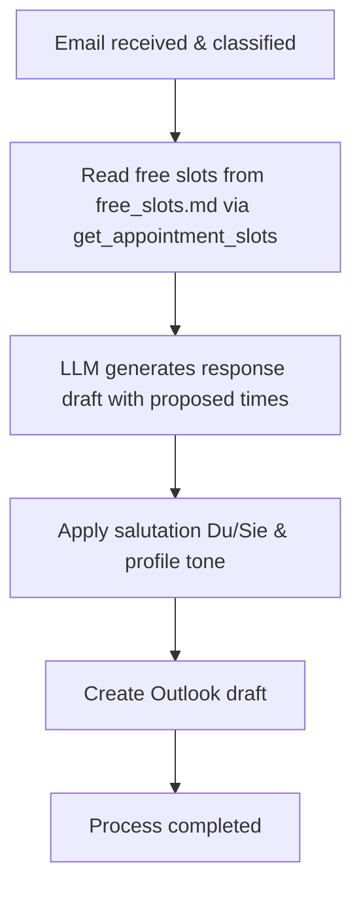

# Action 2: Reply with Appointment Suggestion

This action is used when you need to reply to a request and simultaneously offer concrete appointment suggestions (e.g., for office hours or meetings) from your calendar.

## How it Works and Details

The system performs the following steps during this action:

1.  **Retrieve Free Slots:** The system uses the `get_appointment_slots` tool, which reads the `free_slots.md` file. This file is populated with your current free slots via Outlook VBA macros.
2.  **Formatting and Filtering:** The free slots are read and clearly formatted.
3.  **AI Generation:** The local LLM drafts the reply, integrating the found free slots nicely into the email and asking the recipient to confirm one of the times.
4.  **Salutation and Tone:** The profiles and the determined form of address (Du/Sie) are also taken into account here.
5.  **Draft Creation:** A reply draft is created in Outlook with the integrated appointment suggestions and the original email attached.

---

## Process Flow (Mermaid Diagram)

