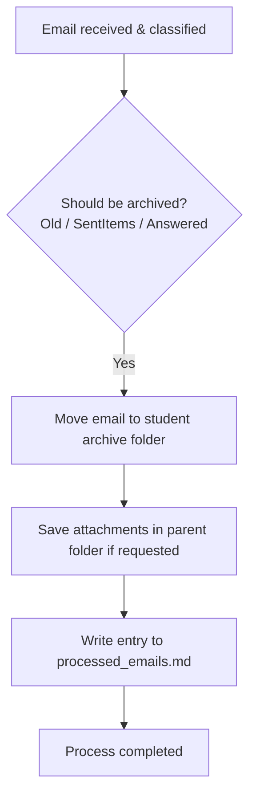

# Action 3: Only Archive

This action is used when no reply is required for an email, and it should simply be stored in the student's archive folder.

## How it Works and Details

The system performs the following steps during this action:

1.  **Automatic Suggestions:** The system automatically suggests this action in the Gradio GUI in the following cases:  
    *   **Old Emails:** Emails older than the configured threshold (e.g., 6 months).  
    *   **Sent Items (`SentItems`):** Emails located in the `SentItems` folder never require a reply.  
    *   **Already Answered:** Emails where the system detects that no further action is necessary.  
2.  **Archiving:** The email is physically moved to the corresponding student archive (`Semester / Lastname / Inbox` or `SentItems`).  
3.  **Attachments (Optional):** If the user selects the "Save attachment" option, the email's attachments are automatically stored directly in the parent student folder.  
4.  **Logging:** The status is recorded in the final report file `processed_emails.md`.  

---

## Process Flow (Mermaid Diagram)

