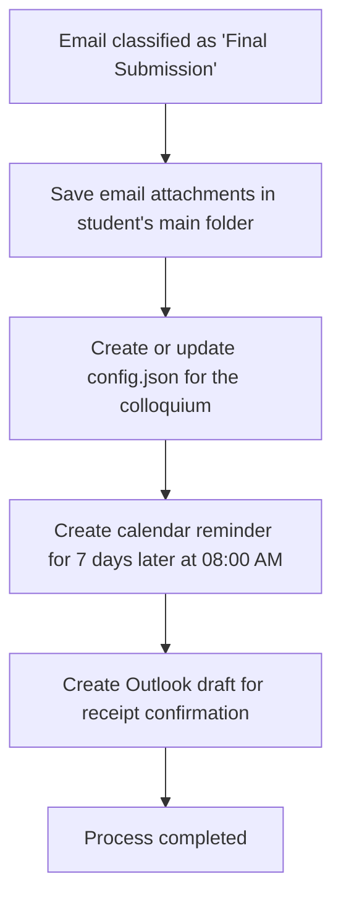

# Action 5: Create Task in Calendar (Final Submission)

This action serves as the central control for the final submission of academic theses (Bachelor's and Master's theses). When the system detects a final submission email, this action coordinates a series of automated steps to assist with the evaluation process.

## How it Works and Details

Once executed, the system automatically performs the following steps:

1.  **Save Attachments:** All email attachments (such as the final thesis PDF) are automatically saved via `save_email_attachments` directly in the student's main folder (`Semester / Lastname /`).
2.  **Colloquium Configuration (`config.json`):** A `config.json` file is automatically created or updated in the student's main folder via `create_colloquium_config`. This file contains the exact filename of the PDF document from the attachment and serves as the configuration interface for the [colloquium-protocol-creator](https://dgaida.github.io/colloquium-protocol-creator/).
3.  **Calendar Reminder in 7 Days:** A calendar entry (reminder) is created in your Outlook calendar via the `manage_calendar_appointment` tool for **exactly 7 days after the email is received, at 08:00 AM**. This reminds you in a timely manner to read and evaluate the submitted thesis.
4.  **Draft Receipt Confirmation:** An email draft is automatically created in Outlook to confirm the official receipt of the thesis to the student.

---

## Process Flow (Mermaid Diagram)

