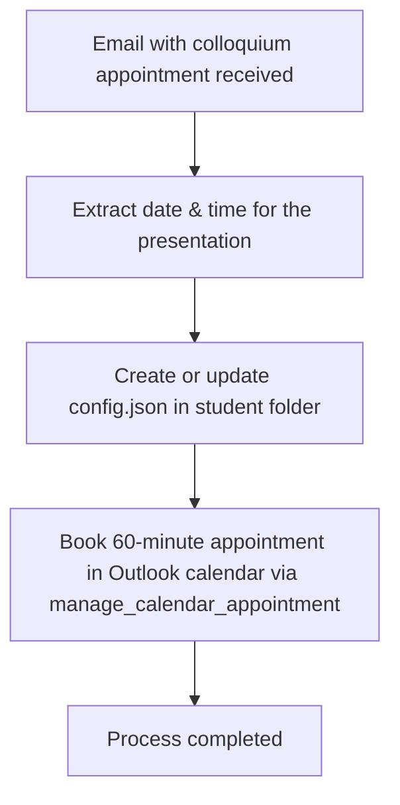

# Action 5: Colloquium Appointment

This action automates the entire process of scheduling and data preparation for the colloquium (the oral defense of an academic thesis).

## How it Works and Details

Once a date for the colloquium is agreed upon and confirmed via email, this action triggers the following processes:

1.  **Date and Time Extraction:** The system extracts the date (in `DD.MM.YYYY` format) and time (in `HH:MM` format) of the colloquium from the email.  
2.  **Create/Update `config.json`:**  
    The system automatically creates a configuration file named `config.json` (or updates an existing one) in the student's main folder. The extracted appointment data (date, time, location type, room) is written into this file. It is subsequently used for downstream tasks like automated presentation slide evaluation or filling out forms.  
3.  **Create Calendar Entry:**  
    The system books a specific **60-minute** appointment directly in your Outlook calendar using the `manage_calendar_appointment` tool to block out the exam period.

---

## Example of the Generated `config.json`

```json
{
  "task": "colloquium",
  "description": "Colloquium on Campus Gummersbach with automatic Gemini evaluation",
  "pdf": {
    "filename": "Bachelor_Thesis.pdf"
  },
  "colloquium": {
    "date": "15.11.2026",
    "time": "14:00",
    "location_type": "campus",
    "room": "3.228"
  },
  "llm": {
    "api_choice": null,
    "model": null,
    "groq_free": true
  },
  "gemini_evaluation": {
    "enabled": false,
    "model": "gemini-2.0-flash-exp"
  },
  "output": {
    "folder": null,
    "compile_pdf": true,
    "fill_form_only": true
  }
}
```

---

## Process Flow (Mermaid Diagram)


